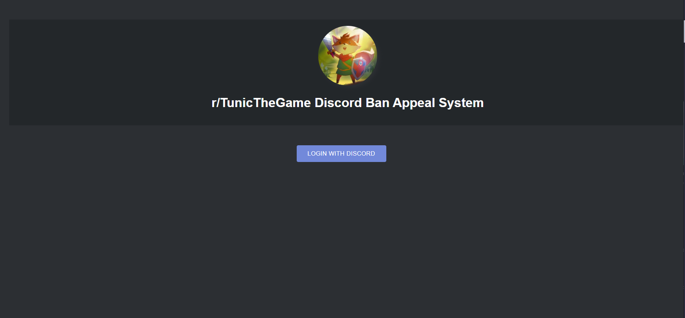
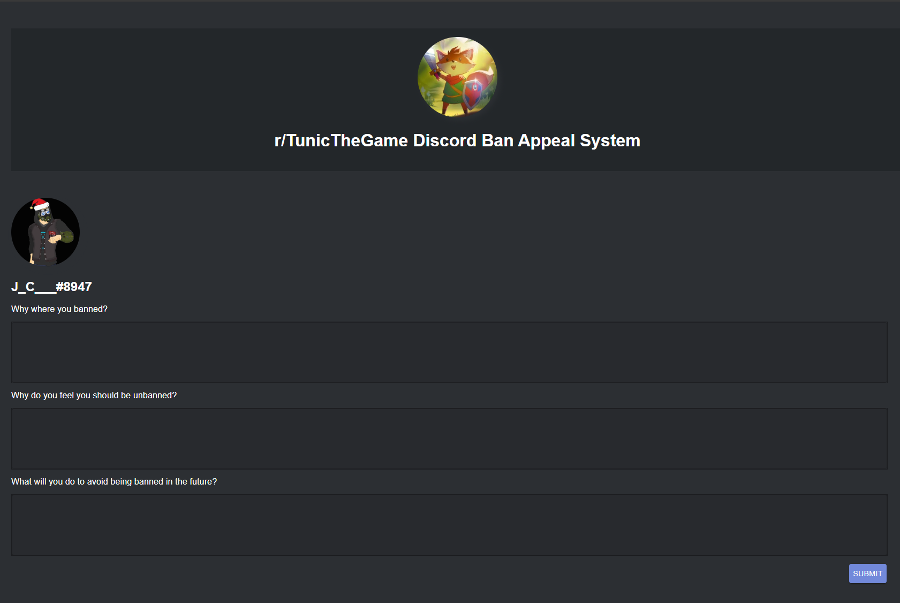

[](https://app.netlify.com/sites/tunic-ban-appeal/deploys)

Inspired by [sylveon](https://github.com/sylveon/discord-ban-appeals)

# [Demo](https://wumpus-ban-appeal.netlify.app)

# How to use this project:
- Have a server where you are an administrator.
- Have a custom bot inside this server. You can register/invte one [here](https://discord.com/login?redirect_to=%2Fdevelopers%2Fapplications)
- Create a #ban-appeals channel (name can be whatever you want) and create a new webhook integration for that channel.
- Fork this repo
- Register an account with [Netlify](https://www.netlify.com/)
- Add your forked repo as a build target
- Fill out the environment variables under Settings > Environment (see .env.example for all the required/optional variables)
```
REACT_APP_CLIENT_ID= //Discord Oauth Application Client ID
REACT_APP_CLIENT_SECRET= //Discord Oauth Application Secret
REACT_APP_WEBHOOK_URL= //The webhook you made for #ban-appeals
REACT_APP_DISCORD_BOT_TOKEN= //Used to check if users are banned and unban them if you click the embed link to do so
REACT_APP_GUILD_ID= //Brands the page with your server name and icon
REACT_APP_JWT_SECRET= //What the tokens for unbanning users are hashed with. Basically a really long password
REACT_APP_SKIP_BAN_CHECK= //Optional, skips the check that only allows submissions from users who are actually banned if set to true
```
- Watch the site build!
- Done!





# Create-React-App Readme
This can mostly be ignored by users. Its is automatically generated by the create-react-app scripts.

## Available Scripts

In the project directory, you can run:

### `yarn start`

Runs the app in the development mode.<br />
Open [http://localhost:3000](http://localhost:3000) to view it in the browser.

The page will reload if you make edits.<br />
You will also see any lint errors in the console.

### `yarn build`

Builds the app for production to the `build` folder.<br />
It correctly bundles React in production mode and optimizes the build for the best performance.

The build is minified and the filenames include the hashes.<br />
Your app is ready to be deployed!

See the section about [deployment](https://facebook.github.io/create-react-app/docs/deployment) for more information.

### `yarn eject`

**Note: this is a one-way operation. Once you `eject`, you can’t go back!**

If you aren’t satisfied with the build tool and configuration choices, you can `eject` at any time. This command will remove the single build dependency from your project.

Instead, it will copy all the configuration files and the transitive dependencies (webpack, Babel, ESLint, etc) right into your project so you have full control over them. All of the commands except `eject` will still work, but they will point to the copied scripts so you can tweak them. At this point you’re on your own.

You don’t have to ever use `eject`. The curated feature set is suitable for small and middle deployments, and you shouldn’t feel obligated to use this feature. However we understand that this tool wouldn’t be useful if you couldn’t customize it when you are ready for it.

## Learn More

You can learn more in the [Create React App documentation](https://facebook.github.io/create-react-app/docs/getting-started).

To learn React, check out the [React documentation](https://reactjs.org/).

### Code Splitting

This section has moved here: https://facebook.github.io/create-react-app/docs/code-splitting

### Analyzing the Bundle Size

This section has moved here: https://facebook.github.io/create-react-app/docs/analyzing-the-bundle-size

### Making a Progressive Web App

This section has moved here: https://facebook.github.io/create-react-app/docs/making-a-progressive-web-app

### Advanced Configuration

This section has moved here: https://facebook.github.io/create-react-app/docs/advanced-configuration

### Deployment

This section has moved here: https://facebook.github.io/create-react-app/docs/deployment

### `yarn build` fails to minify

This section has moved here: https://facebook.github.io/create-react-app/docs/troubleshooting#npm-run-build-fails-to-minify
