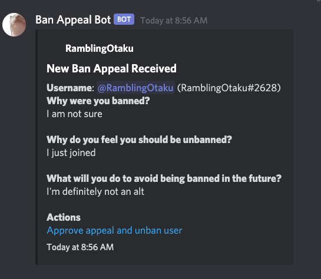

[](https://app.netlify.com/sites/tunic-ban-appeal/deploys)

Inspired by [sylveon](https://github.com/sylveon/discord-ban-appeals)

# [Demo](https://wumpus-ban-appeal.netlify.app)
## [Support Discord Server](https://discord.gg/EnKHckh6d2)

# How to use this project:

**REQUIREMENTS**

- Have a server where you are able to:
    - Make channels
    - Create Webhooks
    - Invite bots

## Easy Way: Deploy on Netlify

[](https://app.netlify.com/start/deploy?repository=https://github.com/jcsumlin/discord-ban-appeal)

- Click the "Deploy to Netlify" button.
    - You will be asked to link your GitHub account then enter values for all the environment variables.
    - Most of the environment variables will be provided by the Discord Application Dashboard
> **NOTE**: If you already have a custom bot in your server and access its credentials skip the next step
- Create a custom bot inside this server. You can register/invite one [here](https://discord.com/developers/applications)
  
- Choose a channel (or create a new one) where you want all the ban appeals to appear.
  - Edit Channel -> Integrations -> Create Webhook
  - Name it whatever you'd like and make sure its "channel" is set to your designated ban appeal channel
  - Copy the Webhook URL and paste it in the `REACT_APP_WEBHOOK_URL` variable on Netlify
- Copy the required keys/secrets from your Discord bot application to the Netlify page.
- Deploy your application
- Lastly we'll want to  make sure users can login using Discord
  - First make any changes to the netlify.app deployment URL you wish, or set up your own custom one!
  - From the [Discord Developer Application page](https://discord.com/developers/applications) Select the OAuth tab 
  - Click on Add Redirect and enter `https://[site-url]/callback` where `[site-url]` is the site name netlify assigned you, or the one you changed it to.

## Environment Variable Information

| Environment Variable | Description | Optional? |
|---|---|---|
| REACT_APP_CLIENT_ID | Client ID of a Discord Application | No |
| REACT_APP_CLIENT_SECRET | Client Secret of a Discord Application | No |
| REACT_APP_WEBHOOK_URL | Webhook created on your ban appeal channel. | No |
| REACT_APP_DISCORD_BOT_TOKEN | The Bot token of a Discord Application | No |
| REACT_APP_GUILD_ID | The Server/Guild ID where you are accepting ban appeals | No |
| REACT_APP_JWT_SECRET | A really long string of characters used to establish <br>a secure line of communication with the API of this app.<br>I would recommend using a password generator to create this. <br>**You don't have to remember what its set to** | No |
| REACT_APP_SKIP_BAN_CHECK | If set to "true" the application will not check if <br>a user is banned before allowing them to fill out <br>an appeal form | Yes |
| REACT_APP_BANNER_URL | Add a custom banner behind your server icon. <br>Must be a direct link to an image <br>(usually ends in .jpeg or .png etc.) | Yes |

## Deploy on your own web server

- Fork this repo
- Copy `.env.example` to `.env` and fill in each value
```
REACT_APP_CLIENT_ID= //Discord Oauth Application Client ID
REACT_APP_CLIENT_SECRET= //Discord Oauth Application Secret
REACT_APP_WEBHOOK_URL= //The webhook you made for #ban-appeals
REACT_APP_DISCORD_BOT_TOKEN= //Used to check if users are banned and unban them if you click the embed link to do so
REACT_APP_GUILD_ID= //Brands the page with your server name and icon
REACT_APP_JWT_SECRET= //What the tokens for unbanning users are hashed with. Basically a really long password
REACT_APP_SKIP_BAN_CHECK= //Optional, skips the check that only allows submissions from users who are actually banned if set to true
```
- Run `yarn install` to install the dependencies
- Run `yarn build` to compile a production build 
- Direct your webserver to serve the `./build/` directory
- Done!





### Differences between this repo and sylveon's
- Server icon and custom banner on landing page
- Only allow users who are actually banned to submit an appeal
  - Ability to disable this check


### Feature plans
- [ ] Allow users to be blocked from submitting a ban appeal
- [ ] Integrate some means of alerting users who are unbanned
- [ ] Additional Actions such as Deny Ban appeal.
- [ ] Custom Questions defined by the user
- [ ] Optional Google Analytics tracking
