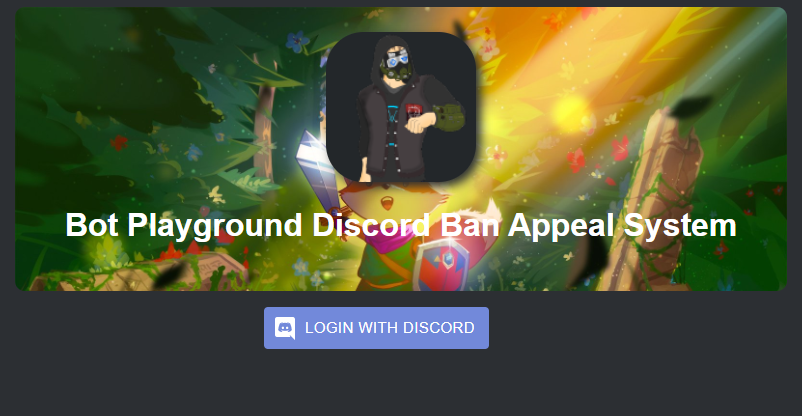
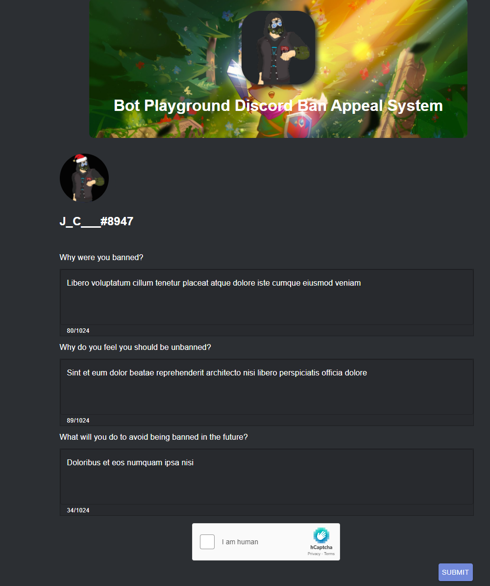
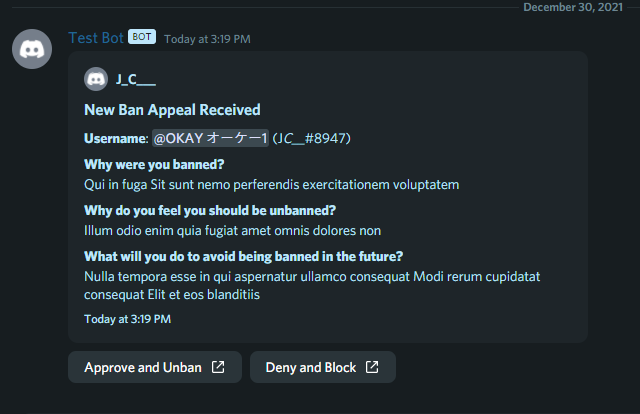

Project Status: 

Inspired by [sylveon](https://github.com/sylveon/discord-ban-appeals)

# [Demo](https://wumpus-ban-appeal.netlify.app)
## [Support Discord Server](https://discord.gg/EnKHckh6d2)

##### Table of Contents
1. [ Deploy on Netlify ](#netlify)
2. [ Deploy on your own web server ](#vps)
2. [ How to block users ](#block)
2. [ How to create your own custom questions ](#questions)
2. [ Differences between this repo and sylveon's ](#diff)
2. [ Feature Roadmap ](#featureplan)

# How to use this project:

**REQUIREMENTS**

- Have a server where you are able to:
    - Make channels
    - Create Webhooks
    - Invite bots

## Easy Way: Deploy on Netlify

- Click the "Deploy to Netlify" button.
    - You will be asked to link your GitHub account then enter values for all the environment variables.
    - Most of the environment variables will be provided by the Discord Application Dashboard
> **NOTE**: If you already have a custom bot in your server and access its credentials skip the next step
- Create a custom bot inside this server. You can register/invite one [here](https://discord.com/developers/applications)
  
- Choose a channel (or create a new one) where you want all the ban appeals to appear.
  - Edit Channel -> Integrations -> Create Webhook
  - Name it whatever you'd like and make sure its "channel" is set to your designated ban appeal channel
  - Copy the Webhook URL and paste it in the `REACT_APP_WEBHOOK_URL` variable on Netlify
- Copy the required keys/secrets from your Discord bot application to the Netlify page.
- Deploy your application
- Lastly we'll want to  make sure users can login using Discord
  - First make any changes to the netlify.app deployment URL you wish, or set up your own custom one!
  - From the [Discord Developer Application page](https://discord.com/developers/applications) Select the OAuth tab 
  - Click on Add Redirect and enter `https://[site-url]/callback` where `[site-url]` is the site name netlify assigned you, or the one you changed it to.

### Environment Variable Information

| Environment Variable          | Description                                                                                                                                                                                                                          | Optional? |
|-------------------------------|--------------------------------------------------------------------------------------------------------------------------------------------------------------------------------------------------------------------------------------|-----------|
| REACT_APP_CLIENT_ID           | Client ID of a Discord Application                                                                                                                                                                                                   | No        |
| REACT_APP_CLIENT_SECRET       | Client Secret of a Discord Application                                                                                                                                                                                               | No        |
| REACT_APP_DISCORD_BOT_TOKEN   | The Bot token of a Discord Application                                                                                                                                                                                               | No        |
| REACT_APP_GUILD_ID            | The Server/Guild ID where you are accepting ban appeals                                                                                                                                                                              | No        |
| REACT_APP_JWT_SECRET          | A really long string of characters used to establish  a secure line of communication with the API of this app. I would recommend using a password generator to create this.  **You don't have to remember what its set to** | No        |
| REACT_APP_SKIP_BAN_CHECK      | If set to "true" the application will not check if  a user is banned before allowing them to fill out  an appeal form                                                                                                          | Yes       |
| REACT_APP_BANNER_URL          | Add a custom banner behind your server icon.  Must be a direct link to an image  (usually ends in .jpeg or .png etc.)                                                                                                          | Yes       |
| REACT_APP_SITE_TITLE          | Use a custom title for your site (defaults to {server_name}'s Discord Ban Appeal Application if none is set)                                                                                                                         | Yes       |
| REACT_APP_SITE_DESCRIPTION    | Use a custom SEO description for your site (defaults to {server_name}'s Discord Ban Appeal Application if none is set)                                                                                                               | Yes       |
| APPEALS_CHANNEL               | The channel where you want appeals to appear in                                                                                                                                                                                      | No        |
| REACT_APP_ENABLE_HCAPTCHA     | Do you want to use hCaptcha in the form? (true/false)                                                                                                                                                                                | Yes       |
| REACT_APP_HCAPTCHA_SITE_KEY   | The hCaptcha site key generated by hCaptcha                                                                                                                                                                                          | Yes       |
| REACT_APP_HCAPTCHA_SECRET_KEY | The secret on your hCaptcha profile                                                                                                                                                                                                  | Yes       |
| REACT_APP_GOOGLE_ANALYTICS_ID | Google Analytics Tracking ID like UA-000000-01.                                                                                                                                                                                      | Yes       |
| REACT_APP_ENABLE_SENDGRID     | Sends users an email when they are unbanned (true/false) See Wiki if you don't know how to set this up                                                                                                                               | No        |
| SENDGRID_API_KEY              | [API Key for Sendgrid](https://app.sendgrid.com/settings/api_keys)                                                                                                                                                                   | Yes       |
| SENDGRID_SENDER_EMAIL         | [Single Sender Verification Email](https://docs.sendgrid.com/ui/sending-email/sender-verification)                                                                                                                                   | Yes       |
| INVITE_URL                    | Discord invite that can be used in email template to unbanned users                                                                                                                                                                  | Yes       |

## Hard Way: Deploy on your own web server

This if by far not the prettiest way to do this which is why I recommend you use netlify, but if you're smart enough to deploy this on your own then go for it!

### Requirements:
 
Be aware this project uses serverless functions as its API layer. 
All the API requests are directed at /.netlify/functions because support issues with netlify's redirect rules. 
To deploy this yourself you will need to create a serverless API using AWS Lambda or an equivalent from Azure or GCP.
I will go into specifics below.

### Web frontend
- Fork this repo
- Copy `.env.example` to `.env` and fill in each value
- Run `yarn install` to install the dependencies
- Run `yarn build` to compile a production build 
- Direct your webserver to serve the `./build/` directory

### Serverless backend

- Create a new serverless API in your cloud provider with 4 endpoints.
    - Each File in `/functions` will be an endpoint, and most of them will require both the files in the `/functions/helpers` folder
- Make sure all the packages from `package.json` are installed and available for each function
- Find and replace all occurrences of `/.netlify/functions/` with your endpoint for each function

I've oversimplified a lot of the serverless portion here since it will vary based on your cloud provider but this covers the jist of things.

## Adding hCaptcha (like reCaptcha)

[See Wiki article](https://github.com/jcsumlin/discord-ban-appeal/wiki/Adding-hCaptcha)

## How to block users from abusing your ban appeal form.
[See Wiki article](https://github.com/jcsumlin/discord-ban-appeal/wiki/Blocking-users-from-submitting-ban-appeals)

## How to create your own custom questions.
[See Wiki article](https://github.com/jcsumlin/discord-ban-appeal/wiki/How-to-create-your-own-custom-questions)

## Adding Email Functionality to appeals form
[See Wiki article](https://github.com/jcsumlin/discord-ban-appeal/wiki/How-to-create-your-own-custom-questions)

## Differences between this repo and sylveon's
- Server icon and custom banner on landing page
- Only allow users who are actually banned to submit an appeal
  - Ability to disable this check
- Custom meta tags for better SEO and visibility.
- **IMO** a cleaner approach to custom questions.

## Feature roadmap
- [x] Allow users to be blocked from submitting a ban appeal
- [x] Add better meta tag support
- [x] Custom Questions defined by the user
- [x] add hCaptcha/reCaptcha
- [ ] Integrate some means of alerting users who are unbanned
- [ ] Additional Actions such as "Deny Ban appeal".
- [ ] Optional Google Analytics tracking
